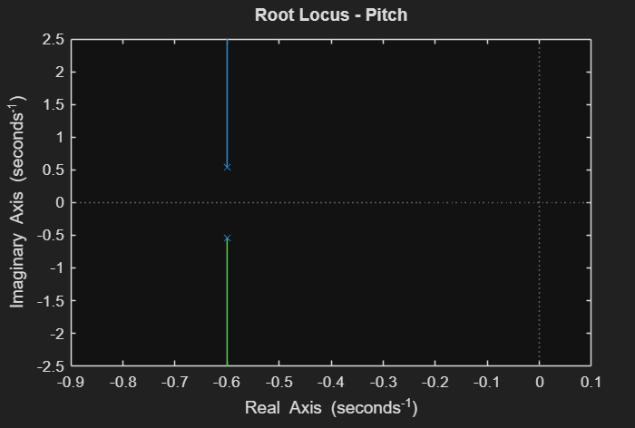
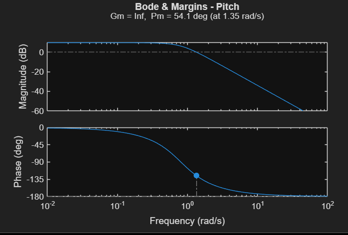
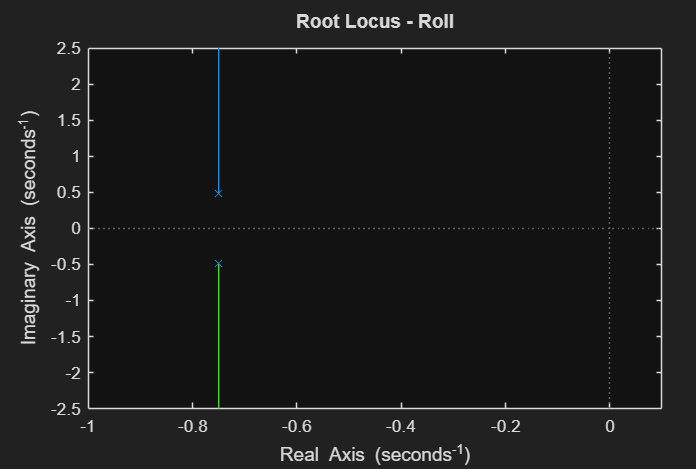

# flight-control-system
MATLAB-Simulink project for pitch and roll control of aircraft using Root Locus, Bode Plot, and LQR techniques
## Overview
This project designs and analyzes pitch and roll control loops for a small aircraft using classical (PD, Root Locus, Bode) and modern (State-Space, LQR) control methods.
It demonstrates how feedback control theory ensures flight stability, fast response, and robustness under parameter variations.
## Tools
MATLAB, Simulink, Root Locus, Bode Plot, State-Space, LQR
## Features
Developed linear state-space models for pitch and roll dynamics.
Performed open-loop analysis (poles, gain/phase margins).
Designed PD, state-feedback, and LQR controllers.
Compared transient responses and robustness under ±20% parameter variations.
Generated Root Locus, Bode, and Nyquist plots for system analysis.
### 🔗 MATLAB Code
[👉 Click here to view flight_pitch_roll.m](flight_pitch_roll.m)
## 📊 Simulation Results

)

